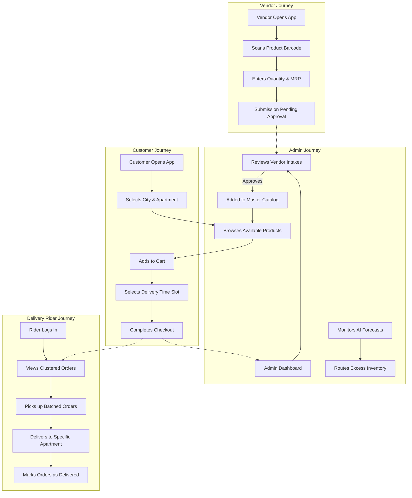

# User Flow & Product Journey

The Hyper-Local Delivery Platform caters to four distinct personas: **Customers**, **Vendors**, **Delivery Riders**, and **Admins**. 

## Core Journey Map

## Detailed Flow Breakdown

### 1. The Customer Journey
- **Onboarding:** The customer lands on the web app and is prompted to select their **City** and **Apartment Complex**. This hyper-localizes their view.
- **Shopping:** The customer browses categories (Groceries, Dairy, etc.) populated from the Master Catalog.
- **Checkout:** The customer adds items to their cart, selects a preferred **Time Slot** (Morning, Afternoon, or Evening), and completes the purchase.
- **Fulfillment:** Order status updates dynamically (Pending -> Packed -> Out for Delivery -> Delivered).

### 2. The Vendor Journey
- **Intake:** Local vendors use the app to scan a product's barcode using their device camera.
- **Stock Update:** They input the quantity and pricing details.
- **Sync:** The data is sent to the admin for approval. Once approved, it reflects in the Master Catalog immediately, making it available for customers to buy.

### 3. The Delivery Rider Journey
- **Dispatch:** Instead of picking up single orders, the rider sees orders batched by **Apartment Block** and **Time Slot**.
- **Delivery:** The rider travels to one location (e.g., "Prestige Apartments") and delivers 30-50 orders in a single trip.
- **Completion:** The rider updates the status for all delivered flats at once.

### 4. The Admin Journey
- **Oversight:** The Admin logs into a central dashboard (`/admin`) to monitor total revenue, pending orders, and registered customers.
- **Catalog Management:** The Admin approves vendor barcode scans and manages categories.
- **AI Forecasting:** The Admin views AI insights identifying demand spikes and inventory depletion risks, enabling dynamic supply rerouting.
